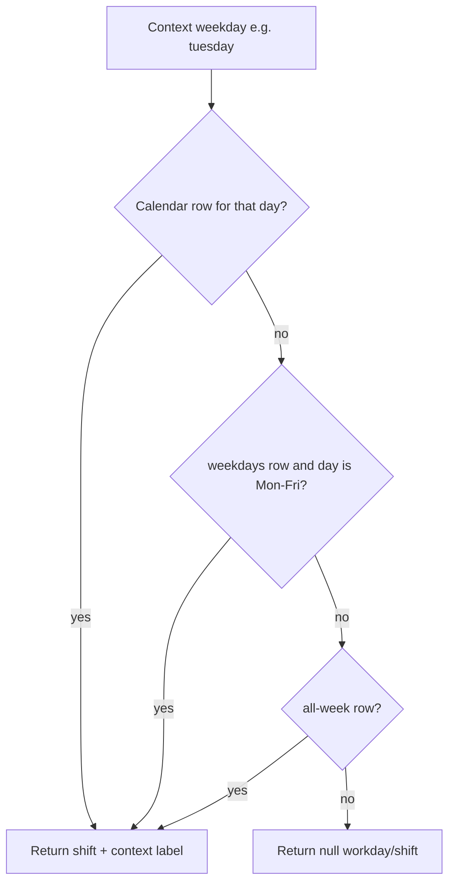

# Database Design

This document describes the MariaDB schema for the LA-Server. Models live in [`app/models.py`](../app/models.py) (Flask-SQLAlchemy). On startup, [`init_db()`](../app/database.py) imports models and runs `db.create_all()` so the schema matches the code. You can also bootstrap an empty database with [`scripts/create_database.py`](../scripts/create_database.py) (creates the DB if needed and relies on the same `create_all()` path).

There is **no Alembic** (or other automated migration runner) in this repository. Deployments always install from scratch: [`scripts/create_database.py`](../scripts/create_database.py) (or app startup via `create_all()`) creates the full schema for an empty database.

**Sign-in and tokens** are handled in the HTTP API ([`app/auth/`](../app/auth/)): passwords are verified against `authentications.password_hash`; successful login issues a **JWT** (not stored in this database). This document only covers **persisted** credential and profile data.

## Shared base (`BaseModel`)

All concrete tables inherit from `BaseModel` (`__abstract__ = True`):

| Column       | SQLAlchemy type                         | Notes                                      |
|-------------|-----------------------------------------|--------------------------------------------|
| `id`        | `Integer`, PK, autoincrement            | Surrogate key                              |
| `created_at`| `DateTime(timezone=True)`, default `utc_now` | Set on insert                         |
| `updated_at`| `DateTime(timezone=True)`, default `utc_now`, `onupdate=utc_now` | Refreshed on update |

## Tables overview

| Table              | Model            | Purpose |
|--------------------|------------------|---------|
| `companies`        | `Company`        | Employers / stations that offer jobs |
| `employees`        | `Employee`       | Camp participants in the Spielstadt (children and staff; each has an `employee_number`) |
| `authentications`  | `Authentication` | Optional 1:1 login profile per camp participant: password hash, forced password change flag, app permission group |
| `job_assignments`  | `JobAssignment`  | Links one camp participant (`employees` row) to one company for a placement |
| `part_times`       | `PartTime`       | Optional part-time slots per camp participant (0..n rows; see [design decisions](#part-time-design-decisions)) |
| `company_jobs_max` | `CompanyJobsMax` | Optional workday + shift overrides for a company's job capacity (0..n rows; see [design decisions](#company-jobs-max-design-decisions)) |
| `attendances`      | `Attendance`     | Daily check-in per camp participant; optional check-out timestamp (see [Attendance](#attendances)) |

---

## `companies`

| Column         | Type              | Constraints / default   |
|----------------|-------------------|-------------------------|
| `id`           | integer           | PK (from `BaseModel`)   |
| `company_name` | `String(255)`     | `NOT NULL`, `UNIQUE`    |
| `jobs_max`     | integer           | `NOT NULL`              |
| `hourly_pay` | integer           | `NOT NULL` (project units) |
| `active`       | boolean           | `NOT NULL`, default `true` |
| `notes`        | `Text`            | nullable                |
| `created_at`, `updated_at` | datetime (tz) | from `BaseModel` |

**Indexes:** primary key on `id`; unique constraint on `company_name`.

---

## `employees`

| Column            | Type              | Constraints / default   |
|-------------------|-------------------|-------------------------|
| `id`              | integer           | PK (from `BaseModel`)   |
| `first_name`      | `String(255)`     | `NOT NULL`              |
| `last_name`       | `String(255)`     | `NOT NULL`              |
| `employee_number` | `String(16)`      | `NOT NULL`, `UNIQUE`, indexed |
| `age`             | integer           | `NOT NULL`              |
| `can_leave_alone` | boolean           | `NOT NULL`, default `true` |
| `role`            | `String(255)`     | `NOT NULL`              |
| `active`          | boolean           | `NOT NULL`, default `true` |
| `notes`           | `Text`            | nullable                |
| `created_at`, `updated_at` | datetime (tz) | from `BaseModel` |

**Indexes:** primary key on `id`; unique index on `employee_number`.

**ORM:** `Employee.authentication` is an optional **one-to-one** to [`Authentication`](#authentications) (`uselist=False`; `passive_deletes=True` so the ORM relies on DB `ON DELETE CASCADE` when a participant row is removed). `Employee.part_times` is an optional **one-to-many** to [`part_times`](#part_times); an empty collection means full-time work — see [Part-time design decisions](#part-time-design-decisions). `Employee.attendances` is a **one-to-many** to [`attendances`](#attendances) (check-in rows per camp day; `passive_deletes=True`).

Checksum validation for `employee_number` (ISO 7064 Mod 97,10) is **not** enforced in the database; it is applied in the HTTP API and bulk import when `VALIDATE_CHECK_SUM` is enabled. See [Employee numbers and check digits](./employee-numbers.md).

---

## `authentications`

| Column                 | Type              | Constraints / default                          |
|------------------------|-------------------|-----------------------------------------------|
| `id`                   | integer           | PK (from `BaseModel`)                         |
| `employee_id`          | integer           | `NOT NULL`, `UNIQUE`, FK → `employees.id`, `ON DELETE CASCADE` |
| `password_hash`        | `String(255)`     | `NOT NULL` (werkzeug hash; see behaviour)    |
| `password_must_change` | boolean           | `NOT NULL`, default `true`                   |
| `auth_group`           | `String(20)`      | `NOT NULL`, default `employee`                |
| `notes`                | `Text`            | nullable                                      |
| `created_at`, `updated_at` | datetime (tz) | from `BaseModel`                              |

**Indexes:** primary key on `id`; unique constraint on `employee_id` (at most one credential row per camp participant).

**ORM:** `Authentication.employee` ↔ `Employee.authentication`.

**Application values for `auth_group`:** `employee`, `staff`, and `admin` (enforced in the API; not an enum in the database).

---

## `job_assignments`

| Column        | Type        | Constraints / default                          |
|---------------|-------------|------------------------------------------------|
| `id`          | integer     | PK (from `BaseModel`)                          |
| `company_id`  | integer     | `NOT NULL`, FK → `companies.id`, `ON DELETE RESTRICT` |
| `employee_id` | integer     | `NOT NULL`, FK → `employees.id`, `ON DELETE RESTRICT` |
| `notes`       | `Text`      | nullable                                       |
| `created_at`, `updated_at` | datetime (tz) | from `BaseModel`                    |

**Indexes:** primary key on `id`; foreign keys on `company_id` and `employee_id`.

**ORM:** `JobAssignment` exposes `companies` → `Company` and `employees` → `Employee` (`back_populates` with `Company.job_assignments` and `Employee.job_assignments`). The attribute names are plural on the assignment side for historical reasons.

---

## `part_times`

| Column        | Type        | Constraints / default                          |
|---------------|-------------|------------------------------------------------|
| `id`          | integer     | PK (from `BaseModel`)                          |
| `employee_id` | integer     | `NOT NULL`, FK → `employees.id`, `ON DELETE CASCADE` |
| `workday`     | `String(20)` | `NOT NULL`                                    |
| `shift`       | `String(20)` | `NOT NULL`, default `all-day`                 |
| `notes`       | `Text`      | nullable                                       |
| `created_at`, `updated_at` | datetime (tz) | from `BaseModel`                    |

**Indexes:** primary key on `id`; foreign key on `employee_id`; unique constraint on (`employee_id`, `workday`) — at most one part-time row per camp participant per stored `workday` key (calendar day or aggregate).

**ORM:** `PartTime.employee` ↔ `Employee.part_times` (collection; may be empty).
`Employee.part_times` may be empty. No related rows means the participant is treated as working **full time** on every day (see [design decisions](#part-time-design-decisions)).

**Application values for `workday` (stored):** `monday` … `sunday`, plus aggregate slugs **`weekdays`** (Mon–Fri) and **`all-week`** (Mon–Sun). Enforced in the API; not an enum in the database. See [`app/schemas/part_time.py`](../app/schemas/part_time.py) (`PartTimeWorkday`, `PART_TIME_STORED_WORKDAYS`, `verify_part_time_stored_workday`). List query filters accept calendar slugs only — see [Aggregate workdays](#aggregate-workdays-weekdays-all-week).

**Application values for `shift`:** `all-day`, `morning`, and `afternoon` (enforced in the API; not an enum in the database). The same slugs are stored in `part_times.shift`, returned in JSON employee responses, and accepted on list query filters. Clients can read the allowed values from `GET /api/village-data` under `la-server.part_time_workdays` and `la-server.part_time_shifts`.


### Part-time design decisions {#part-time-design-decisions}

These rules describe how clients and the API should interpret storage; they are **not** enforced by MariaDB constraints beyond `NOT NULL` on `workday` when a row exists.

Two cases are easy to confuse. **Zero rows** means the participant works **full time every day** (a normal camp week). **One or more rows** defines a part-time schedule: on any calendar day with no matching row after precedence, the API returns **no slot** (`workday`/`shift` null) — **not** full time on those days. Each stored row is a **`workday`** (which days) plus a **`shift`** (morning, afternoon, or all-day).

1. **Default: no rows = full time.** If a camp participant has **no** `part_times` rows, they work **all day, every day**. The table is optional; there is no separate “part-time” flag on `employees`.
2. **One calendar day, full day.** A row with `workday` = `monday` … `sunday` and `shift` = `all-day` (the column default) means the participant works **that entire weekday** (e.g. `friday` → all day Friday). On create, `shift` may be omitted when the default applies.
3. **One calendar day, half day.** A row with a calendar `workday` and `shift` = `morning` or `afternoon` means the participant works **only that shift** on that weekday — not the full day.
4. **Weekday bundle (`weekdays`).** A row with `workday` = `weekdays` and `shift` = `morning` or `afternoon` applies that shift on **Monday through Friday** (*Werktage*). It does **not** apply on Saturday or Sunday. See [Aggregate workdays](#aggregate-workdays-weekdays-all-week).
5. **Whole-week bundle (`all-week`).** A row with `workday` = `all-week` and `shift` = `morning` or `afternoon` applies that shift on **every day** Monday through Sunday.
6. **Precedence when rows overlap.** For each calendar day, pick **one** effective slot in this order: **calendar-day row** → **`weekdays` row** (Mon–Fri only) → **`all-week` row** → **no slot**.
   - Example: `weekdays/morning` + `friday/afternoon` → Mon–Thu morning, Fri afternoon, Sat–Sun no slot (unless `all-week` is also stored).
   - Example: `all-week/morning` + `tuesday/afternoon` → Tue afternoon; all other days morning.
7. **Invalid combinations and query-only values.**
   - **`weekdays` or `all-week` + `all-day`** is invalid — aggregates are only for half-day shifts. Full time everywhere = **zero rows** (rule 1), not an aggregate row.
   - Valid stored `workday` values: `monday` … `sunday`, `weekdays`, or `all-week`.
   - List query **`workday=all`** is filter-only and is **never** stored.
   - **Write enforcement:** **`POST`**, **`PUT`**, and **`DELETE ?workday=`** on **`/api/part-time/{employee_number}`** call [`validate_part_time_combination()`](../app/schemas/part_time.py) and [`verify_part_time_stored_workday()`](../app/schemas/part_time.py) before persisting. Invalid combinations → **`400`** **`INVALID_PART_TIME_COMBINATION`**. MariaDB alone does not reject invalid rows; direct SQL inserts can still bypass the API.

A participant may have **multiple** `part_times` rows (e.g. `weekdays/morning` plus `friday/afternoon`, or three calendar-day rows). The database enforces **at most one row per (`employee_id`, `workday`)** — you cannot store two different shifts for the same stored `workday` key in separate rows; pick `morning`, `afternoon`, or `all-day` (calendar days only) for that key. An employee may hold both a **`weekdays`** row and an **`all-week`** row (different keys); precedence resolves which applies on each calendar day. Days with no matching row after precedence have **no slot** (rule 6). Rule 1 applies only when there are **zero** rows total.

### Aggregate workdays (`weekdays`, `all-week`) {#aggregate-workdays-weekdays-all-week}

Aggregate slugs replace duplicate calendar-day rows when the same shift repeats across many days. For staff-oriented **before/after row examples** and list-filter behaviour, see [developer-guide.md — Aggregate part-time patterns](./developer-guide.md#aggregate-part-time-patterns).

| Stored row | Replaces |
|------------|----------|
| `{ workday: "weekdays", shift: "morning" }` | Five rows (`monday` … `friday`, each `morning`) |
| `{ workday: "all-week", shift: "morning" }` | Seven rows (`monday` … `sunday`, each `morning`) |

**Why they exist:** without aggregates, a participant who works mornings every weekday (Mon–Fri) needs five identical rows; a seven-day camp pattern needs seven. One aggregate row expresses the same schedule and stays consistent when edited.

#### Terminology

| Term | Meaning |
|------|---------|
| **`workday` (column / API field)** | The part-time schedule key — singular field name, unchanged |
| **Calendar workday** | Stored slug `monday` … `sunday` — one day |
| **`weekdays` (stored slug)** | **Monday through Friday** — German *Werktage*; **not** the field name |
| **`all-week` (stored slug)** | **Monday through Sunday** — every calendar day |
| **`all-day` (shift slug)** | Full day on the matched day — analogous to how aggregate slugs span multiple days |
| **`workday=all` (list query only)** | Do not filter by part-time day — **never stored** |

#### `weekdays` vs `all-week`

| Slug | Scope | Typical use |
|------|-------|-------------|
| **`weekdays`** | Mon–Fri | “Morning every weekday”; weekends off |
| **`all-week`** | Mon–Sun | Seven-day camp; same shift every day including Sat/Sun |

**Does not apply on Saturday/Sunday:** a **`weekdays`** row never matches Saturday or Sunday — enforced by [`is_weekdays_calendar_day()`](../app/schemas/part_time.py) in slot resolution and list SQL. On those days, only a **calendar-day row** for that day or an **`all-week`** row can supply a slot.

#### Shift pairing (rule 7)

Aggregate rows pair only with **`morning`** or **`afternoon`**. **`weekdays`/`all-week` + `all-day`** is **invalid** by design (rule 7). **`POST`** / **`PUT /api/part-time/{employee_number}`** call [`validate_part_time_combination()`](../app/schemas/part_time.py) and return **`INVALID_PART_TIME_COMBINATION`**; direct database inserts can still bypass the API.

| Stored combination | Valid? | Use instead |
| ------------------ | ------ | ----------- |
| `weekdays` + `morning` / `afternoon` | Yes | — |
| `all-week` + `morning` / `afternoon` | Yes | — |
| `weekdays` + `all-day` | **No** | Five calendar rows with `all-day`, or one `weekdays` + `morning`/`afternoon` if only a shift applies |
| `all-week` + `all-day` | **No** | **Delete all part-time rows** for full-time everywhere (rule 1) — not an aggregate row |

**Full-time everywhere:** zero `part_times` rows. Do **not** store `all-week` + `all-day` as a shortcut for “works every day all day”; that blurs full-time vs part-time semantics.

#### Precedence (worked examples)

**Example A — `weekdays/morning` + `friday/afternoon`:**

| Context day | Effective shift |
|-------------|-----------------|
| Monday–Thursday | `morning` (from `weekdays`) |
| Friday | `afternoon` (calendar row overrides `weekdays`) |
| Saturday, Sunday | no slot (`workday`/`shift` null in API) unless `all-week` is also stored |

**Slot lookup by calendar day (Example A stored rows: `weekdays/morning`, `friday/afternoon`):**

| Calendar day | Effective shift | Source |
|--------------|-----------------|--------|
| `monday` | `morning` | `weekdays` |
| `tuesday` | `morning` | `weekdays` |
| `wednesday` | `morning` | `weekdays` |
| `thursday` | `morning` | `weekdays` |
| `friday` | `afternoon` | calendar row (overrides `weekdays`) |
| `saturday` | — | no row matches |
| `sunday` | — | no row matches |

**Example B — `all-week/morning` + `tuesday/afternoon`:**

| Context day | Effective shift |
|-------------|-----------------|
| Tuesday | `afternoon` (calendar override) |
| All other days | `morning` (from `all-week`) |

**Slot lookup by calendar day (Example B stored rows: `all-week/morning`, `tuesday/afternoon`):**

| Calendar day | Effective shift | Source |
|--------------|-----------------|--------|
| `monday` | `morning` | `all-week` |
| `tuesday` | `afternoon` | calendar row (overrides `all-week`) |
| `wednesday` | `morning` | `all-week` |
| `thursday` | `morning` | `all-week` |
| `friday` | `morning` | `all-week` |
| `saturday` | `morning` | `all-week` |
| `sunday` | `morning` | `all-week` |

Slot lookup follows the same order as [`resolve_part_time_slot()`](../app/schemas/part_time.py):



#### Storage vs API projection

| Layer | What appears |
|-------|----------------|
| **Database `part_times.workday`** | Stored slug: calendar day, **`weekdays`**, or **`all-week`** |
| **Employee JSON `workday`** | **Never** aggregate slugs — always the **context label**: **`today`**, a calendar name (`monday` … `sunday`), or **`null`** |
| **List filter `?workday=`** | Calendar slugs, **`today`**, or **`all`** only — **`weekdays`** / **`all-week`** → **`400`** **`INVALID_PART_TIME_WORKDAY`** |
| **`GET /api/village-data`** | **`la-server.part_time_workdays`** lists **all stored** values including aggregates (for data entry / scripts) — see [developer-guide.md](./developer-guide.md#aggregate-part-time-patterns) |
| **`/api/part-time/{employee_number}`** | Admin CRUD on stored rows; returns stored slugs (including aggregates), not contextual **`today`** — see [developer-guide.md — Part-time API](./developer-guide.md#part-time-api) |

#### Unique constraint

At most **one row per (`employee_id`, `workday`)** — including aggregate keys. An employee may have both **`weekdays`** and **`all-week`** rows (different keys); precedence picks the effective row per calendar day.

### Camp timezone (configuration, not in MariaDB)

Which calendar day counts as **“today”** for the camp is **not** stored in the database. It comes from **`general.timezone`** in **`village_data/village.ini`** (IANA name such as `Europe/Berlin`; see the [README](../README.md) **`[general]`** section). The server resolves it at runtime via **`get_camp_timezone()`** in [`app/village_config.py`](../app/village_config.py) (`zoneinfo.ZoneInfo`). If the key is missing, empty, or invalid, the server falls back to **`Europe/Berlin`** and logs a warning.

That timezone drives weekday lookup for **`workday=today`** on employee lists and for **calendar today** on single-employee and profile responses.

### API projection: `full_time`, `workday`, and `shift` (not stored columns) {#api-projection-workday-shift}

Employee JSON includes **`full_time`**, **`workday`**, and **`shift`**. These are **derived at serialisation time** from `employees.part_times` and a **context weekday** — they are **not** columns on `employees`.

| Field       | Source | Meaning |
|------------|--------|---------|
| `full_time` | `len(part_times) == 0` | `true` when the participant has no part-time rows (full-time worker). |
| `workday`   | Effective slot for the context calendar day via [`resolve_part_time_slot()`](../app/schemas/part_time.py) (precedence: calendar > `weekdays` > `all-week`) | Response label when a slot exists: **`today`**, a calendar weekday slug (`monday` … `sunday`), or **`null`**. **Never** **`weekdays`** or **`all-week`**. |
| `shift`     | Effective row’s `part_times.shift` | **`all-day`**, **`morning`**, or **`afternoon`** when `workday` is set; **`null`** when `workday` is **`null`**. |

**Context weekday** depends on the endpoint:

| Endpoint / list query | Context weekday | Typical `workday` label when a slot exists |
|-----------------------|-----------------|--------------------------------------------|
| `GET /api/employees` (default `workday=all`) | Calendar **today** in camp timezone | `"today"` |
| `GET /api/employees?workday=today` | Calendar **today** in camp timezone | `"today"` (list filtered to participants with a slot today) |
| `GET /api/employees?workday=tuesday` | **`tuesday`** (filter + label) | `"tuesday"` |
| `GET /api/employees/<employee_number>`, `GET /api/auth/me` | Calendar **today** in camp timezone (ignores list query) | `"today"` or `null` |

Example: camp calendar is **Wednesday**, list uses **`?workday=tuesday`** → participants match if they have a direct **`tuesday`** row, or **`weekdays`** (+ shift) with no overriding **`tuesday`** row, or **`all-week`** (+ shift) with no overriding calendar or **`weekdays`** match; each returned row shows **`"workday": "tuesday"`** and the effective **`shift`**. With default **`workday=all`**, all employees are listed; each row’s **`workday`** / **`shift`** describe the slot for **Wednesday** (today), so a participant with only **`weekdays/morning`** shows **`"workday": "today"`** and **`"shift": "morning"`** — not **`"weekdays"`**.

List filters (not stored): optional **`shift`** when **`workday`** is not **`all`** restricts to the effective shift for that filter day (same precedence as slot resolution). Filter values **`weekdays`** and **`all-week`** are invalid → **`400`**. Calendar helpers ([`camp_day()`](../app/camp_time.py)) and part-time query resolution ([`resolve_part_time_slot()`](../app/schemas/part_time.py), [`parse_list_workday_param()`](../app/schemas/part_time.py), [`employee_context_workday_and_shift()`](../app/schemas/part_time.py)) live in [`app/camp_time.py`](../app/camp_time.py) and [`app/schemas/part_time.py`](../app/schemas/part_time.py); list SQL mirrors precedence in [`app/repositories/employee.py`](../app/repositories/employee.py). Staff-facing filter examples: [developer-guide.md — List filter behavior](./developer-guide.md#aggregate-part-time-patterns).

---

## `company_jobs_max`

| Column        | Type        | Constraints / default                          |
|---------------|-------------|------------------------------------------------|
| `id`          | integer     | PK (from `BaseModel`)                          |
| `company_id`  | integer     | `NOT NULL`, FK → `companies.id`, `ON DELETE CASCADE` |
| `workday`     | `String(20)` | `NOT NULL`                                    |
| `shift`       | `String(20)` | `NOT NULL`, default `all-day`                 |
| `jobs_max`    | integer     | `NOT NULL`                                     |
| `notes`       | `Text`      | nullable                                       |
| `created_at`, `updated_at` | datetime (tz) | from `BaseModel`                    |

**Indexes:** primary key on `id`; foreign key on `company_id`; unique constraint on (`company_id`, `workday`, `shift`) — at most one override row per company per stored `workday` **and** `shift` key (`uq_company_jobs_max_company_workday_shift`).

**ORM:** `CompanyJobsMax.company` ↔ `Company.company_jobs_max` (collection; may be empty).
`Company.company_jobs_max` may be empty. No related rows means the company uses its default cap from **`companies.jobs_max`** (see [design decisions](#company-jobs-max-design-decisions)).

**Application values for `workday` (stored):** same slugs as [`part_times`](#part_times) — `monday` … `sunday`, **`weekdays`**, and **`all-week`**. Validated via [`verify_part_time_stored_workday()`](../app/schemas/part_time.py). Clients can read allowed values from `GET /api/village-data` under **`la-server.company_jobs_max_workdays`**.

**Application values for `shift`:** `all-day`, `morning`, and `afternoon` (canonical slugs in [`app/camp_time.py`](../app/camp_time.py); re-exported from [`app/schemas/part_time.py`](../app/schemas/part_time.py)). Listed under **`la-server.company_jobs_max_shifts`** on **`GET /api/village-data`**.

**Relationship to `job_assignments`:** no schema change. All current assignments count against the **effective cap for camp now** ([`effective_jobs_max()`](../app/schemas/company_jobs_max.py)). There is no foreign key from assignments to schedule rows.

### Company jobs max design decisions {#company-jobs-max-design-decisions}

These rules describe how clients and the API interpret storage; they are **not** fully enforced by MariaDB beyond `NOT NULL` and the unique constraint.

Each stored row is a **`workday`** (which days) plus a **`shift`** (morning, afternoon, or all-day) and an override **`jobs_max`** cap. Resolution uses **camp calendar today** ([`camp_day()`](../app/camp_time.py)) and **current camp shift** ([`camp_shift()`](../app/camp_time.py)) — see [Camp shift boundary](#camp-shift-boundary).

1. **Default: no rows = stored default cap.** If a company has **no** `company_jobs_max` rows, **`companies.jobs_max`** is the effective cap at all times. The table is optional; there is no separate flag on `companies`.
2. **One calendar day, full day.** A row with `workday` = `monday` … `sunday` and `shift` = `all-day` (the column default) overrides capacity for **that entire weekday** when the lookup shift is **`all-day`** — not when [`camp_shift()`](../app/camp_time.py) returns **`morning`** or **`afternoon`**.
3. **One calendar day, half day.** A row with a calendar `workday` and `shift` = `morning` or `afternoon` applies only when the current camp shift matches that slug.
4. **Weekday bundle (`weekdays`).** A row with `workday` = `weekdays` and `shift` = `morning` or `afternoon` applies that cap on **Monday through Friday** for the matching shift only.
5. **Whole-week bundle (`all-week`).** A row with `workday` = `all-week` and `shift` = `morning` or `afternoon` applies that cap on **every day** Monday through Sunday for the matching shift.
6. **Precedence when rows overlap.** For each calendar day and shift lookup, pick **one** effective row in this order: **calendar-day row** → **`weekdays` row** (Mon–Fri only) → **`all-week` row** → **no matching row** (fallback to **`companies.jobs_max`**). Shift must match exactly; **`all-day`** rows never match **`morning`**/**`afternoon`** lookups.
   - Example: base `companies.jobs_max` = 10, plus `weekdays/morning` → 5 and `weekdays/afternoon` → 2. Wednesday **12:59** camp time → cap **5**; **13:00** → cap **2**; Saturday with no matching row → fallback **10**.
7. **Invalid combinations.** **`weekdays` or `all-week` + `all-day`** is invalid — same rule as part-time aggregates. Restore the default cap everywhere by **deleting all** schedule rows, not by storing an aggregate **`all-day`** row.
8. **Write enforcement:** **`POST`**, **`PUT`**, and **`DELETE ?workday=&shift=`** on **`/api/company-jobs-max/{company_name}`** call the same part-time validators plus **`verify_jobs_max()`** for the override cap. Invalid combinations → **`400`** **`INVALID_PART_TIME_COMBINATION`**; invalid cap → **`400`** **`INVALID_JOBS_MAX`**.

Unlike **`part_times`**, the unique key is **`(company_id, workday, shift)`**, so **`weekdays/morning`** and **`weekdays/afternoon`** can coexist as separate rows. Slot lookup filters by shift first, then applies workday precedence — see [`resolve_company_jobs_max_slot()`](../app/schemas/company_jobs_max.py).

Aggregate workday semantics, precedence examples, and storage-vs-projection rules mirror [Part-time design decisions](#part-time-design-decisions) and [Aggregate workdays](#aggregate-workdays-weekdays-all-week); the main differences are the unique key (includes **`shift`**), the payload field **`jobs_max`**, and fallback to **`companies.jobs_max`** when no row matches.

### Camp shift boundary {#camp-shift-boundary}

Which **shift** counts as “now” for the camp is **not** stored in MariaDB and is **not** configured in **`village.ini`**. It is defined in code:

| Constant | Value | Meaning |
|----------|-------|---------|
| **`CAMP_AFTERNOON_STARTS_AT`** | **`13:00`** camp-local | Morning before 13:00; afternoon from 13:00 **inclusive** |

[`camp_shift()`](../app/camp_time.py) returns **`morning`** or **`afternoon`** only (never **`all-day`**). Canonical shift slugs live in [`CampShift`](../app/camp_time.py) / **`CAMP_SHIFTS`**; part-time and company-jobs-max APIs reuse them.

**`all-day`** schedule rows apply only when the lookup shift is **`all-day`** (for example admin tooling). They do **not** match live **`camp_shift()`** lookups used on company GET responses and job-assignment capacity checks.

### API projection: `default_jobs_max`, `workday`, and `shift` on companies (not stored columns) {#api-projection-company-jobs-max}

Company JSON includes **`default_jobs_max`**, **`workday`**, and **`shift`**, plus derived **`jobs.max`** and **`jobs.available`**. These are **computed at serialisation time** from `companies.jobs_max`, `companies.company_jobs_max`, assignment counts, **`camp_day()`**, and **`camp_shift()`** — they are **not** columns on `companies`.

| Field | Source | Meaning |
|-------|--------|---------|
| `default_jobs_max` | `len(company_jobs_max) == 0` | `true` when the company has no schedule rows (uses stored default cap only). Parallel to employee **`full_time`**. |
| `workday` | Effective slot via [`resolve_company_jobs_max_slot()`](../app/schemas/company_jobs_max.py) | **`today`** when a row matches camp now; **`null`** when rows exist but none match. **Never** **`weekdays`** or **`all-week`**. |
| `shift` | Matching row’s `shift`, or projection default | **`all-day`** when **`default_jobs_max`**; row shift when a slot matches; **`null`** when rows exist but none match. |
| `jobs.max` | [`effective_jobs_max()`](../app/schemas/company_jobs_max.py) | Effective cap **right now** (override row or fallback to **`companies.jobs_max`**). |
| `jobs.available` | `jobs.max` − current assignment count | May be **negative** if the cap was lowered below existing assignments. |

**Context** is always **calendar today in camp timezone** plus **`camp_shift()`** — company GET/list/create/update responses do **not** accept **`?workday=`** or **`?shift=`** query parameters.

| Situation | `default_jobs_max` | `workday` | `shift` | `jobs.max` |
|-----------|-------------------|-----------|---------|------------|
| No schedule rows | `true` | `"today"` | `"all-day"` | `companies.jobs_max` |
| Row matches camp now | `false` | `"today"` | row shift | row `jobs_max` |
| Rows exist, no match | `false` | `null` | `null` | `companies.jobs_max` (fallback) |

Stored schedule slugs appear on **`GET /api/company-jobs-max/{company_name}`** only — not on **`GET /api/companies`**. Helpers: [`company_context_workday_and_shift()`](../app/schemas/company_jobs_max.py), [`CompanyResponse.from_orm()`](../app/schemas/company.py). Staff-facing API details: [developer-guide.md — Company jobs max context](./developer-guide.md#company-jobs-max-context-on-company-responses).

**Job assignments:** [`POST /api/job-assignments`](../app/services/job_assignment.py) rejects new placements when the assignment count is already **`>= effective_jobs_max()`** → **`400`** **`NO_JOB_LEFT`**.

---

## `attendances`

| Column        | Type              | Constraints / default                          |
|---------------|-------------------|------------------------------------------------|
| `id`          | integer           | PK (from `BaseModel`)                          |
| `employee_id` | integer           | `NOT NULL`, FK → `employees.id`, `ON DELETE CASCADE` |
| `camp_date`   | `Date`            | `NOT NULL` — calendar date in camp timezone    |
| `checkin_at`  | `DateTime(timezone=True)` | `NOT NULL` — server timestamp at check-in |
| `checkout_at` | `DateTime(timezone=True)` | nullable — set only by check-out API |
| `created_at`, `updated_at` | datetime (tz) | from `BaseModel`                    |

**Indexes:** primary key on `id`; foreign key on `employee_id`; unique constraint on (`employee_id`, `camp_date`) — at most **one attendance row per camp participant per camp day (`uq_attendances_employee_camp_date`).

**ORM:** `Attendance.employee` ↔ `Employee.attendances` (collection; may be empty).

### One row per participant per camp day

Each check-in creates a row for **camp today** (calendar date in the camp timezone — see [Camp timezone](#camp-timezone-configuration-not-in-mariadb)). A second check-in for the same participant on the same `camp_date` violates the unique constraint and the API returns **`409`** **`CONSTRAINT_VIOLATION`**.

**Check-out is optional.** Most camp participants stay all day and never receive a `checkout_at` value. Staff may record an early departure via **`POST /api/attendance/check-out/{employee_number}`**, which sets `checkout_at` to the server’s current time. Nothing in the application **requires** check-out; job-assignment gates and the derived **`checked_in`** flag look only at whether a row exists for today, not at `checkout_at`.

### `checkin_at` and `checkout_at`

| Column | Set by | Notes |
|--------|--------|-------|
| **`checkin_at`** | **`POST /api/attendance/check-in/{employee_number}`** (staff auth) | Always **`NOT NULL`**. Value is the server’s timezone-aware **`now()`** at insert — never supplied by the client. |
| **`checkout_at`** | **`POST /api/attendance/check-out/{employee_number}`** (staff auth) | Starts **`NULL`**. Updated once when check-out is recorded; remains **`NULL`** if the participant never checks out. A second check-out on the same row → **`409`** **`CONSTRAINT_VIOLATION`**. |

Both POST endpoints reject **any request body** (including `{}`) with **`400`** **`REQUEST_BODY_NOT_ALLOWED`** so clients cannot forge timestamps. See [Security — attendance writes](#security-attendance-writes).

### API projection: `checked_in` (not a stored column) {#api-projection-checked-in}

Employee JSON includes **`checked_in`** (boolean). It is **derived at serialisation time** from `attendances` — it is **not** a column on `employees`.

| Field | Source | Meaning |
|-------|--------|---------|
| `checked_in` | Row exists in `attendances` for **`camp_date` = calendar today** in camp timezone | `true` when the participant has checked in today; `false` otherwise. **`checkout_at` is ignored** — a row with check-out still recorded counts as checked in. |

**Context day** is always **calendar today** in camp timezone (same as single-employee / profile part-time context), not the list query’s optional `?workday=` filter.

Endpoints that include **`checked_in`:** `GET /api/employees` (each row), `GET /api/employees/{employee_number}`, and `GET /api/auth/me`. Helpers live in [`app/repositories/attendance.py`](../app/repositories/attendance.py) and [`app/services/employee.py`](../app/services/employee.py).

### Employee list filters (`checked_in`, `auth_group`) {#employee-list-attendance-filters}

`GET /api/employees` accepts optional query filters that use the same **`attendances`** data as the derived **`checked_in`** field. They are applied in list SQL ([`app/repositories/employee.py`](../app/repositories/employee.py) — `_apply_list_filters`) so **`count`** matches **`employees[]`**.

| Query param | Value | SQL effect |
|-------------|-------|------------|
| **`checked_in`** | omit | No attendance filter (all rows matching other params) |
| **`checked_in`** | `true` / `1` / `yes` | **`EXISTS`** row in **`attendances`** for **`camp_date` = calendar today** in camp timezone |
| **`checked_in`** | `false` / `0` / `no` | **`NOT EXISTS`** such a row |
| **`auth_group`** | omit | No auth-tier filter |
| **`auth_group`** | `employee`, `staff`, or `admin` | **`OUTER JOIN authentications`**; match **`auth_group`**, or treat **no auth row** as **`employee`** when filtering for **`employee`** |

**Calendar day:** the **`checked_in`** filter always uses **camp today** ([`camp_today()`](../app/camp_time.py)), not the list’s optional **`?workday=`** part-time filter. **`checkout_at`** is ignored — checked out early still counts as checked in.

**Compose** with existing list filters: **`active`**, **`workday`**, **`shift`**. Invalid **`auth_group`** → **`400`** **`INVALID_AUTH_GROUP`**. Staff-facing examples: [developer-guide.md — List employees](./developer-guide.md#list-employees---apiemployees).

**When to use which read API:**

| Need | Endpoint |
| ---- | -------- |
| Gate roster — full profile, filter not checked in / by tier | **`GET /api/employees`** with **`?checked_in=`** / **`?auth_group=`** |
| Audit log — who scanned in and **when** (`checkin_at`) | **`GET /api/attendance/check-ins`** |
| Early departures with **`checkout_at`** | **`GET /api/attendance/check-outs`** |

### Attendance list queries (`workday`)

`GET /api/attendance/check-ins`, `GET /api/attendance/check-outs`, and optional `?workday=` on `GET /api/attendance/{employee_number}` resolve a **`camp_date`** from the query slug (default **`today`**). Rules mirror part-time calendar slugs: **`monday` … `sunday`** map to that weekday in the ISO week containing camp today; invalid slugs such as **`all`**, **`weekdays`**, or **`all-week`** → **`400`** **`INVALID_ATTENDANCE_WORKDAY`**. Camp calendar helpers ([`camp_today()`](../app/camp_time.py)) and attendance query resolution ([`resolve_attendance_workday()`](../app/schemas/attendance.py)) live in [`app/camp_time.py`](../app/camp_time.py) and [`app/schemas/attendance.py`](../app/schemas/attendance.py).

| Endpoint | Rows returned for resolved `camp_date` |
|----------|----------------------------------------|
| **`GET /api/attendance/check-ins`** | All attendance rows (everyone who checked in) |
| **`GET /api/attendance/check-outs`** | Rows where **`checkout_at IS NOT NULL`** only |

### Security — attendance writes {#security-attendance-writes}

The `attendances` table is an **audit trail** for daily presence. The API deliberately limits how rows can change:

| Allowed | Forbidden |
|---------|-----------|
| **`POST /api/attendance/check-in`** — **INSERT** one row; `checkin_at` = server `now()` | Client-supplied timestamps (any request body on POST → **`400`**) |
| **`POST /api/attendance/check-out`** — **UPDATE** `checkout_at` only on today’s row; server `now()` | **`PUT`**, **`PATCH`**, or **`DELETE`** on attendance rows |
| Staff-only auth on both POST paths | Requiring check-out anywhere in the application |

**Direct SQL** (or tools bypassing the HTTP API) can still insert or mutate rows; MariaDB does not enforce the POST-only write policy. Operations should rely on the documented API paths.

**Job-assignment gate:** when village configuration requires attendance for a participant, **`POST`** and **`DELETE`** on **`/api/job-assignments`** require a check-in row for camp today (`checkout_at` not checked). Configuration keys **`require_attendance_for_kids`** and **`require_attendance_for_staff`** live in **`village.ini`** — see the [README](../README.md) and [developer-guide.md](./developer-guide.md).

**Fresh installs only:** like other tables, `attendances` is created by `db.create_all()` on startup or [`scripts/create_database.py`](../scripts/create_database.py). There is no migration path for adding this table to an existing deployment.

---

## Entity-relationship diagram

```mermaid
erDiagram
    companies {
        int id PK
        string company_name UK
        int jobs_max
        int hourly_pay
        boolean active
        text notes
        datetime created_at
        datetime updated_at
    }
    employees {
        int id PK
        string first_name
        string last_name
        string employee_number UK
        string role
        boolean active
        text notes
        datetime created_at
        datetime updated_at
    }
    authentications {
        int id PK
        int employee_id FK_UK
        string password_hash
        boolean password_must_change
        string auth_group
        text notes
        datetime created_at
        datetime updated_at
    }
    job_assignments {
        int id PK
        int company_id FK
        int employee_id FK
        text notes
        datetime created_at
        datetime updated_at
    }
    part_times {
        int id PK
        int employee_id FK
        string workday
        string shift
        text notes
        datetime created_at
        datetime updated_at
    }
    company_jobs_max {
        int id PK
        int company_id FK
        string workday
        string shift
        int jobs_max
        text notes
        datetime created_at
        datetime updated_at
    }
    attendances {
        int id PK
        int employee_id FK
        date camp_date
        datetime checkin_at
        datetime checkout_at
        datetime created_at
        datetime updated_at
    }
    companies ||--o{ job_assignments : company_id
    companies ||--o{ company_jobs_max : company_id
    employees ||--o{ job_assignments : employee_id
    employees ||--o| authentications : employee_id
    employees ||--o{ part_times : employee_id
    employees ||--o{ attendances : employee_id
```

---

## Behaviour notes

### Company (`companies`)

- Each row represents an **employer** in the Spielstadt that offers jobs.
- `company_name` must be unique.
- `jobs_max` is the **default** cap on concurrent assignments when no schedule row matches camp now (see [Company jobs max design decisions](#company-jobs-max-design-decisions)). Effective cap and **`jobs.available`** on API responses use [`effective_jobs_max()`](../app/schemas/company_jobs_max.py).
- `hourly_pay` is amount of money **camp participants** (children and staff in their Spielstadt roles) get for one hour of work.
- `active` marks whether the company is offering jobs. `notes` is optional free text.
- **API projection:** list/get/create/update responses add **`default_jobs_max`**, **`workday`**, **`shift`**, and derived **`jobs.max`** / **`jobs.available`** — see [API projection: `default_jobs_max`, `workday`, and `shift` on companies](#api-projection-company-jobs-max).

### Company jobs max (`company_jobs_max`)

- Optional **workday + shift** overrides for a company's job capacity. **`Company.company_jobs_max` may be empty** — then **`companies.jobs_max`** applies everywhere.
- Unique on (`company_id`, `workday`, `shift`) — morning and afternoon caps can coexist on the same stored `workday` key (unlike `part_times`).
- **`ON DELETE CASCADE`:** if a company row is removed, all its schedule rows are removed with it.
- **`workday`** and **`shift`** use the same slug sets as [`part_times`](#part_times); aggregate + **`all-day`** combination rules match part-time rule 7.
- **`jobs_max`** on each row is the override cap when that slot matches camp now ([`camp_day()`](../app/camp_time.py) + [`camp_shift()`](../app/camp_time.py)).
- Admin CRUD at **`/api/company-jobs-max/{company_name}`**; stored slugs are not exposed on **`GET /api/companies`**. See [developer-guide.md — Company jobs max API](./developer-guide.md#company-jobs-max-api).

### Employee (`employees`)

- Each row is a **camp participant** at the Spielstadt: **children** and **staff** use the same `employees` table and `employee_number`; `role` and `notes` record the distinction in practice.
- **Soft delete:** `active` defaults to `true`. Deleting a camp participant via the API (paths still say `employee`) normally sets `active` to `false` to preserve history; hard delete is a separate API path.
- Login capability is **not** implied by this table alone: see [`authentications`](#authentications).

### Authentication (`authentications`)

- At most one row per `employees.id`. **`ON DELETE CASCADE`:** if a camp participant row is **removed from the database**, their credential row is removed with it (API **soft delete** keeps the `employees` row, so the credential usually remains).
- `password_hash` holds a **werkzeug** hash ([`generate_password_hash`](https://werkzeug.palletsprojects.com/)); the application hashes with [`app/auth/utils.py`](../app/auth/utils.py) (`hash_password` lowercases the plain password before hashing, and `verify_password` lowercases on check), so **sign-in is case-insensitive**.
- `password_must_change`: when `true`, clients should drive the user through the documented **set-password** flow after login. The login API surfaces this flag in its JSON.
- `auth_group` is the **application permission** tier (`employee` / `staff` / `admin`), distinct from the descriptive camp **`role`** string on `employees`.
- **Initial password (not a separate column):** on **`POST /api/employees`**, CSV bulk import, and staff **`POST /api/auth/password/reset-password`**, the server sets `password_hash` from a hash of that participant’s **`employees.last_name`** (trimmed) and sets `password_must_change` to `true`. See the README [Initial password](../README.md#initial-password) section and [developer-guide.md](./developer-guide.md).

### Part-time (`part_times`)

- **`Employee.part_times` may be empty.** No rows: participant works **full time**. One or more rows: each defines part-time for a stored `workday` key (calendar day or aggregate), scoped by `shift` — see [Part-time design decisions](#part-time-design-decisions) and [Aggregate workdays](#aggregate-workdays-weekdays-all-week).
- Multiple rows per `employees.id` are allowed (e.g. `weekdays/morning` + `friday/afternoon`, or three calendar days). Unique on (`employee_id`, `workday`) — at most one row per stored key, including **`weekdays`** and **`all-week`**. **`ON DELETE CASCADE`:** if a camp participant row is removed, all their part-time rows are removed with it.
- `workday` (`NOT NULL`): calendar slug (`monday` … `sunday`) or aggregate slug (**`weekdays`**, **`all-week`**).
- `shift` (`NOT NULL`, default `all-day`): on calendar days, `all-day` = full day; `morning` or `afternoon` = that shift only. On aggregates, only `morning` or `afternoon` is valid.
- **API projection:** list/get/profile responses add **`full_time`**, **`workday`**, and **`shift`** via slot resolution plus camp timezone — see [API projection: `full_time`, `workday`, and `shift`](#api-projection-workday-shift). JSON **`workday`** is always a **context label** (`today`, calendar name, or `null`); aggregate slugs are **never** exposed in employee responses.

### Attendance (`attendances`)

- Records **daily check-in** for a camp participant. **`camp_date`** is the calendar date in the camp timezone (see [Camp timezone](#camp-timezone-configuration-not-in-mariadb)); **`checkin_at`** is the server timestamp when staff scanned the passport at the gate.
- **`checkout_at`** is **optional**. Most rows keep it **`NULL`** all day. Early pickup or similar exceptions are recorded with **`POST /api/attendance/check-out`**; check-out is never required by business rules.
- At most **one row per (`employee_id`, `camp_date`)**. Duplicate check-in or check-out → **`409`** **`CONSTRAINT_VIOLATION`**. **`ON DELETE CASCADE`:** if a camp participant row is removed, all their attendance rows are removed with it.
- **Write paths:** only **`POST /api/attendance/check-in`** (insert) and **`POST /api/attendance/check-out`** (update `checkout_at` only). No request body; timestamps are server-only — see [Security — attendance writes](#security-attendance-writes).
- **Read projection:** employee list/get/profile JSON adds **`checked_in`** when a row exists for calendar today — see [API projection: `checked_in`](#api-projection-checked-in). The employee **list** can also **filter** by **`?checked_in=`** and **`?auth_group=`** — see [Employee list filters](#employee-list-attendance-filters). Job-assignment create/delete may require today’s row depending on **`village.ini`** switches (row presence only; `checkout_at` ignored).

### Job assignment (`job_assignments`)

- Links one camp participant (`employees` row) to one company row.
- Foreign keys use **`ON DELETE RESTRICT`**: remove or reassign assignments before deleting a company or camp-participant row at the database level.
- Multiple `job_assignments` rows per camp participant are allowed over time; the **API** enforces at most one current assignment per camp participant when creating assignments.
- **Capacity check:** assignment create compares the company's current assignment count to [`effective_jobs_max()`](../app/schemas/company_jobs_max.py) (schedule-aware); not merely **`companies.jobs_max`** when overrides exist.
- **`job_assignment_number` is not a stored column.** It is a derived value computed at API serialisation time by `create_job_assignment_number(id)` in [`app/utils.py`](../app/utils.py): an asterisk (`*`) followed by the five-digit zero-padded `id` and two ISO 7064 Mod 97,10 check digits calculated on those digits (e.g. `id` 1 → `*0000197`). The DELETE endpoint path uses this value to identify the row; no separate column is needed.

### Soft-delete strategy

Prefer `employees.active = false` (and similar business rules for companies in the API) over physical deletes unless you intentionally hard-delete and have cleared dependent rows first.
